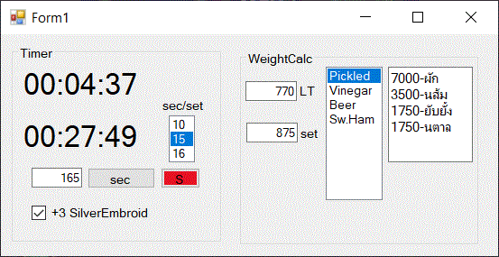
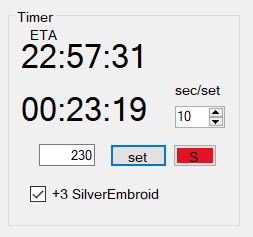
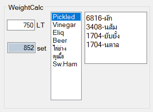

# BDO-CraftTools

A Windows desktop utility for **Black Desert Online** cooking — combines a crafting timer and an ingredient weight calculator in one window.



## Features

### Left panel — Cooking Timer
Alerts you when your cooking utensil durability is about to run out.

1. Enter the durability of your cooking utensil (or expected durability decrease).
2. Select cooking time per second based on your gear.
3. Press **Set** — countdown begins. The window flashes **red** when time is up.
4. Press **Stop** or any key to reset.

> A 10% padding is automatically added to account for cook timing variance.

### Right panel — Weight & Ingredient Calculator
Calculates how many cooking sets fit in your remaining carry weight.

1. Enter available carry weight (LT) in the upper spinner.
2. Select a food from the list.
3. The tool shows how many sets you can carry and the exact ingredient amounts needed.

## Screenshots

| Left | Right |
|------|-------|
|  |  |

## Build

Open `WindowsFormsTimer01/WindowsFormsTimer01.sln` in Visual Studio and build. Requires .NET Framework (Windows).

## Adding or Editing Recipes

Edit `data.txt` next to the `.exe`. Each line uses this format:

```
FoodName,weightPerSet,qty1,Ingredient1,qty2,Ingredient2,...
```

Example:
```
Beer,0.59,5,Grain,6,Water,2,Leavening,1,Sugar
```

- `weightPerSet` — total weight of one ingredient set in LT
- Ingredient pairs repeat: `quantity,name`
