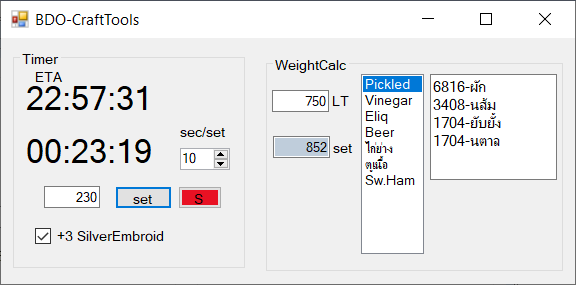

# BDO-CraftTools

## ส่วนทางซ้าย  
นาฬิกาจับเวลา และเด้งเตือนนิดหน่อย  
  
1.กรอกวินาทีที่ใช้ในการทำอาหารต่อครั้ง  เช่น กรอก 15 สำหรับอุปกรณ์ทำอาหารพื้นเมืองบาเลนอส  ถ้ามีบัฟลดเวลาทำอาหารก็คำนวณลดลงไปด้วย  
2.กรอกจำนวนครั้งที่จะทำอาหาร  ค่าความคงทนของอุปกรณ์ทำอาหารจะลดลงตามนี้  
3.กดตั้งเวลา  นาฬิกาเริ่มเดินทันที  
4.ปุ่ม Reset  
5.ถ้าขี้เกียจคำนวณ  ติ๊กถูกตรงนี้จะลดเวลาทำอาหารลง 4 วินาที  

## ส่วนทางขวา  
เครื่องคิดเลขคำนวณน้ำหนักวัตถุดิบทำอาหาร  
  
1.กรอกน้ำหนักในตัวที่เหลืออยู่  
2.แสดงเลขจำนวนชุดอาหารที่จะทำได้  
3.เลือกอาหารที่จะทำ สามารถเพิ่ม/ลบได้ ในไฟล์ data.txt  
4.แสดงส่วนผสมและจำนวนที่จะเอาออกมาจากคลัง  
เช่น  จากภาพ 817 - 45 = 772  
  
เอา 772 ไปกรอก  เลือกอาหารที่จะทำ  แล้วใส่วัตถุดิบตามนั้น  
  

### Note
- ผลของอาหารที่เพิ่มน้ำหนักสูงสุดจะหมดอายุขณะทำอาหาร เช่น เซตอาหารครอนเพิ่มอาหารทะเล +100LT ถ้ามันหมดอายุไปตั้งแต่ 3 วินาทีแรก  น้ำหนักเกิน  ยืนนิ่งนะครับ
- อาหารบางชนิดทำแล้วน้ำหนักเพิ่มขึ้น  เช่น เนื้อนกย่าง

Contact me via discord.  
D.C.Infected#7624
